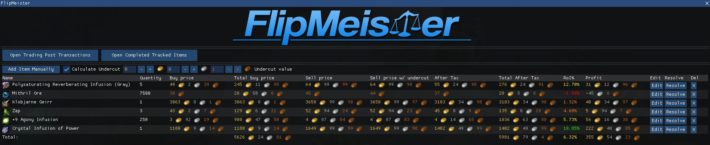

# GW2Nexus-FlipMeister

Guild Wars 2 Addon that tracks investments bought from the trading post. Developed for [Nexus](https://raidcore.gg/Nexus)

## Features
- A tracker that tracks bought items, waiting for them to be sold at the right moment.
- A completed tracking section that tracks your completed flips and shows profits.
- A Trading Post UI where you can directly track your items from your listings or history.

## Planned Features
- Track items from your characters inventories or (guild)bank.
- Watch, watch your favorite items on the trading post and aid in making calculated decisions.

_items and values are fictional_